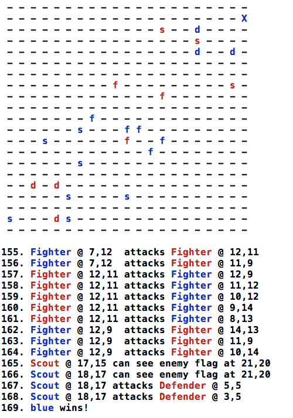

QUICK START
-----------
For more detail and background, see below.

Directories:

ruby-v1    First Ruby version
ruby-v2    Threaded Ruby version
vexil      Elixir version (in progress)

First, `cd` into the `vexil` directory.

`mix test` To run tests
`mix vexil.game run` To run the game itself

The code is very incomplete and buggy.

Next steps:
  - more tests?
  - fix grid display issues
  - detect end of game and terminate
  - show ongoing history

Vexil 
-----

**[Note: This game is only an example for a book in progress. It is not a "serious" game.]**

**Also: This repo will be public for a couple of days while people evaluate and comment.**
**If you want to help with the Elixir version, let me know.**

This is a simple "capture the flag" type of game. I call it Vexil (a name 
derived from the Latin <i>vexillum</i> for "flag").

Vexil is <i>not</i> a board game, although glancing at it might make you think so.
It actually derives from <b>[discuss Core Wars and Darwin]</b>.

In a board game like chess or checkers, there are two opponents, each with 
absolute knowledge of the entire board. But in Vexil, the opponents are more
like <i>teams</i> (labeled "red" and "blue"). Each player on a team is intended to 
act autonomously, with no global knowledge of the grid and no single point of
control.

So a good analogy is the "battling bots" type of game which we've seen many times
in the past. I'm sure you can see the direction this is going. Each player or 
piece will (ultimately) be controlled by a single process; these processes will
collaborate to defeat those on the other team. As such, it will finally be a 
battle of algorithms, where coders write their best logic for the bots and then
turn them loose on the grid. The "referee" process will manage communication, 
enforce the rules, prevent (easy) cheating, and declare a winner.

So on to the details. The Vexil grid is 21 by 21 for a total of 441 cells.
The Red team originates in the lower left portion, diagonally across from the
Blue team on the upper right.

Each team views the grid in its own coordinate system. The <i>x</i> and <i>y</i> values 
can vary from 1 to 21. For example, the cell that the Red team calls <tt>3,5</tt>
will be viewed as <tt>19,17</tt> from the Blue side.

Each team has a "flag" that is randomly placed by the referee within four cells
of the corner (i.e., somewhere in that 4-by-4 area). We'll call this zone 1.
Besides the flag, nothing starts out in this area,

There are three kinds of pieces or players. Each kind is characterized by its
abilities in several areas of behavior:

 * It can <i>see</i> a square sub-grid centered on itself and "know" what is in each of the nearby occupied cells (friend or for or flag);
 * It can <i>move</i> a certain number of cells per turn, any combination of horizontal and vertical moves;
 * It can <i>defend</i> itself by withstanding an attack up to a certain number of points of damage;
 * It can <i>attack</i> and inflict damage points on an opposing piece;
 * It can attack within a limited <i>range</i> (true distance between cells),

The following rules apply. Some are dictated by common sense, while others are
more or less arbitrary.

 * No cell can contain more than one piece at a time; possible collisions will be resolved randomly.
 * Every piece "knows" where its team's flag is.
 * No piece knows the enemy flag's location until it is in visual range.
 * A piece cannot "see" through other pieces regardless of range.
 * A piece can always see farther than it can move.
 * A piece always has an attack range less than its range of motion.
 * Pieces may communicate with their own team members (by "radio") regardless of distance.
 * Mutual attacks will be resolved randomly.
 * When a piece receives damage, it never recuperates; when its constitution (or "hit points") reaches zero, it dies and is removed from the grid.
 * Pieces never run out of "ammunition" (ability to attack).
 * Pieces may not attack their own team.
 * When a piece moves onto the cell containing the enemy's flag, the game is over.
 * A piece may of course not capture its own flag.

So as I said, there are three kinds of pieces. The <i>defender</i> cannot see or move
very far, but it can attack and it is difficult to kill. The <i>scout</i> can see far
and move quickly, but cannot attack (or withstand attacks) very well. The
<i>fighter</i> is faster than the defender but slower than the scout; it is tougher
than the scout, but not so tough as the defender; and it is the best attacker
of all. 

**[some material omitted]**
 
Here is a screenshot of the end of a game:

Ruby/Elixir versions
--------------------

The code is very simplistic in terms of displaying the grid. It simply clears
the screen and redraws it.

The initial Ruby version (ruby-v1) was not threaded. The second one (ruby-v2)
is threaded, but it does not differ much.

The Elixir version is not yet written. Only a few pieces exist. Refer to the
'vexil' directory.

<meta charset='UTF-8'>

